<br />
<br />

# API REQUEST CREATION

Using Postman you will consume a WhoisXLMAPI endpoint to get the whois record of the domain - facebook.com
<br /><br />

## 1. Getting Authentication Key

Once logged in at WhoisXLMAPI:<br />
 Look for your username on the top right corner of the browser and click on it.<br />
 Click on _My products_.

<div id="CopyKey"></div><br />

 Copy your API key.<br /><br />
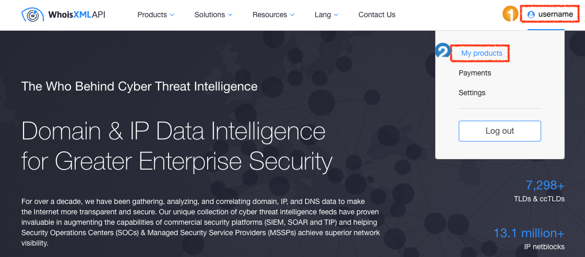<br />

and then, <br />

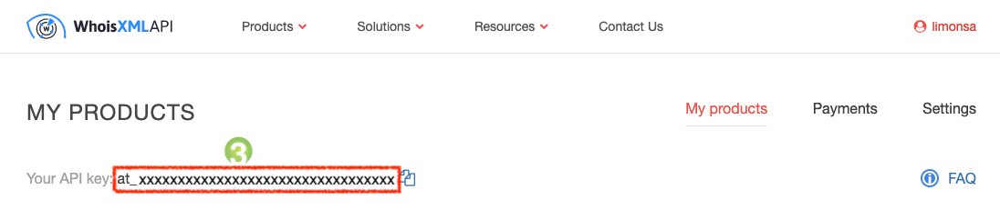
<br /><br /><br />

## 2. Setting up the request environment

Log in Postman and create a new environment. **You can ether** <br />
 On the left menu, select the option Environment <br />
 Click on the **+** icon<br /><br />
<br />

**OR**

 On the top menu, go to _My Workspace_ and click on the _New_ button.<br />
 On the pop-up menu, select the option Environment<br /><br />
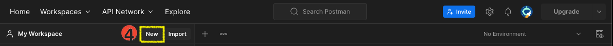<br />

and then, <br />

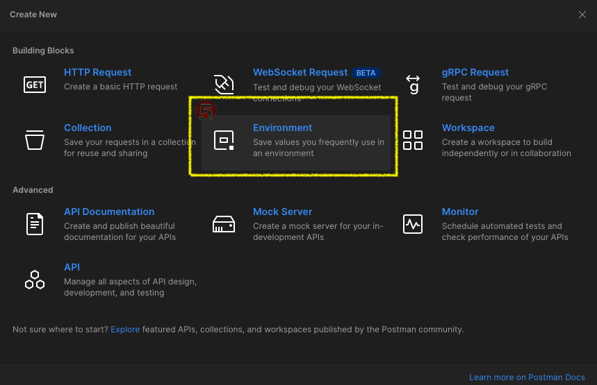
<br /><br />

 Remember to name the environment you created. In this particular example, the environment has been called _API request_ <br />
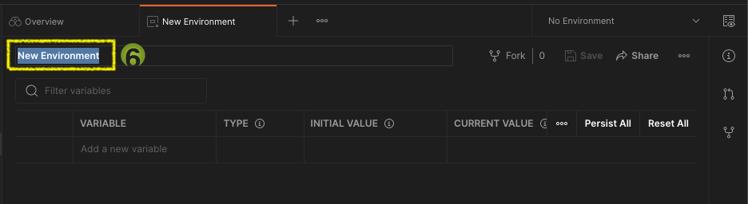

<br />

 Click on the **...** icon to set the environment you created as active environment <br />


<br />

Within this new environment, **create a new variable** to save the API key that you [previously copied](#CopyKey). <br />

>  **Use variables to reuse values and protect sensitive data** <br /> Your API key is sensitive data; therefore, store it in variable type secret to keep its values masked on the screen.
{: .prompt-tip }

<br /><br />

### Environment variable creation
1. Within the environment you created **type the name** of your choosing for the variable that will store the API Key. In this particular example, the given name is _api_key_
2. Select the **type secret** to keep the value masked on the screen
3. **Paste the _API Key_** you already copied in [](#CopyKey) in the fields INITIAL VALUE and CURRENT VALUE
4. **Save environment** to keep the changes
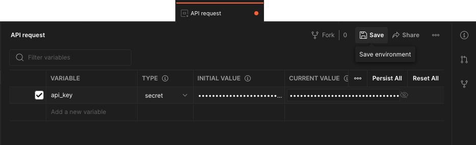

<br /><br />

## 3. Consuming an API endpoint
Within _My Workspace_ look for the option Requests on the right menu. Select the **+** icon to **_Create new request_**

>  **The active environment should be one you created** <br /> As shown in  for this particular example the active environment is _API request_. 
{: .prompt-warning }

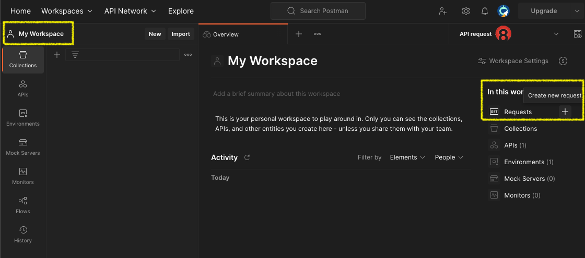

<br />
You are ready to consume the WhoisXLMAPI endpoint to get the whois record of the domain - facebook.com

>  **The API endpoint to get is:** <br /> **GET** https://www.whoisxmlapi.com/whoisserver/WhoisService?apiKey=API_KEY&domainName=DOMAIN
{: .prompt-info }

You must provide two params: 
- **apiKey:** which is ready in the environment variable (called _api_key_ in this example) 
- **domainName:** which is facebook.com

Additionally, another parameter can be send:
- **outputFormat**: which is JSON to get the response in a JSON format. By default, the response is given in XML format.

Type the get endpoint call. Since you are consuming the endpoint it must be a GET call:
```
https://www.whoisxmlapi.com/whoisserver/WhoisService?
```

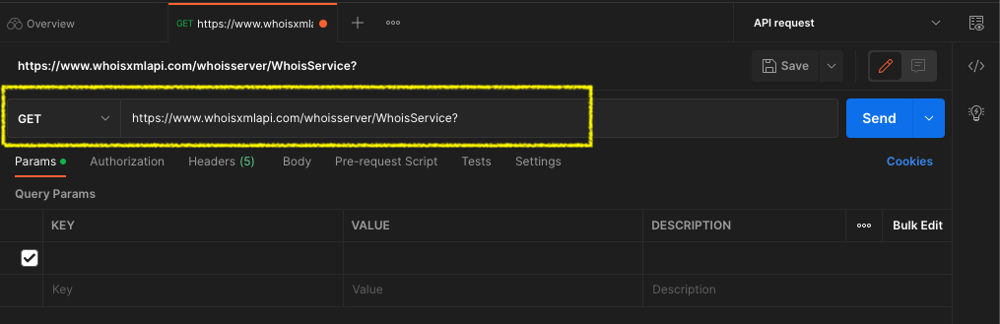

<br />

In the Params tab populate the first Query Params as follows:
- **KEY:** apiKey
- **VALUE**: type **{** to access the dropdown list and select the environment variable that contains the _API key_


<br />

Keep populating the rest Query Params as follows:
- **KEY:** apiKey
- **VALUE**: type **{** to access the dropdown list and select the environment variable that contains the _API key_ <br />
  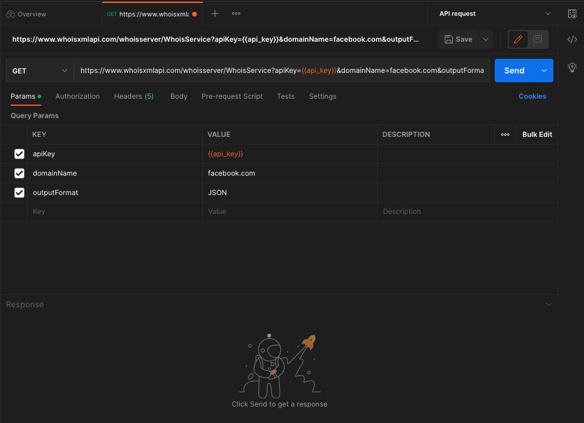

<br />

 Last step: Follow the Postman suggestion 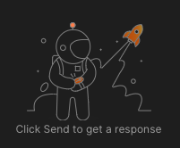 by click on the blue Send button on the top right.

<br />

The Status:200 OK means that the request was successful. You must see the response in JSON format: <br />
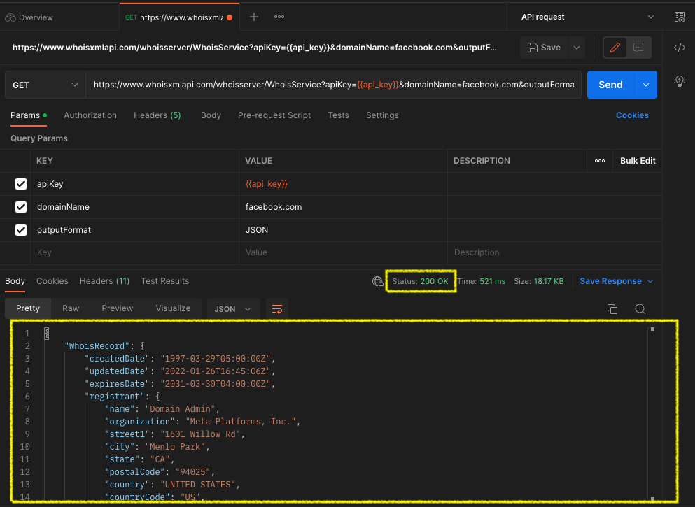

<br />

You can save your request knowing that is working:
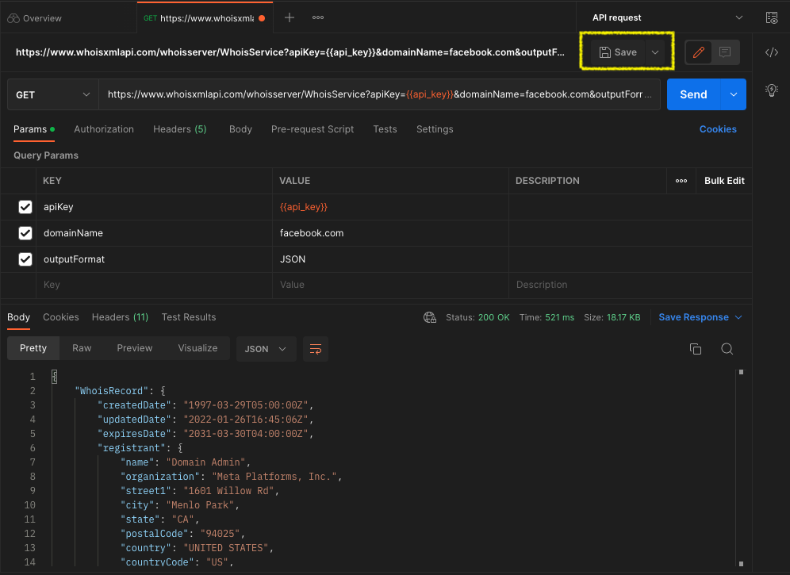

<br /><br />
