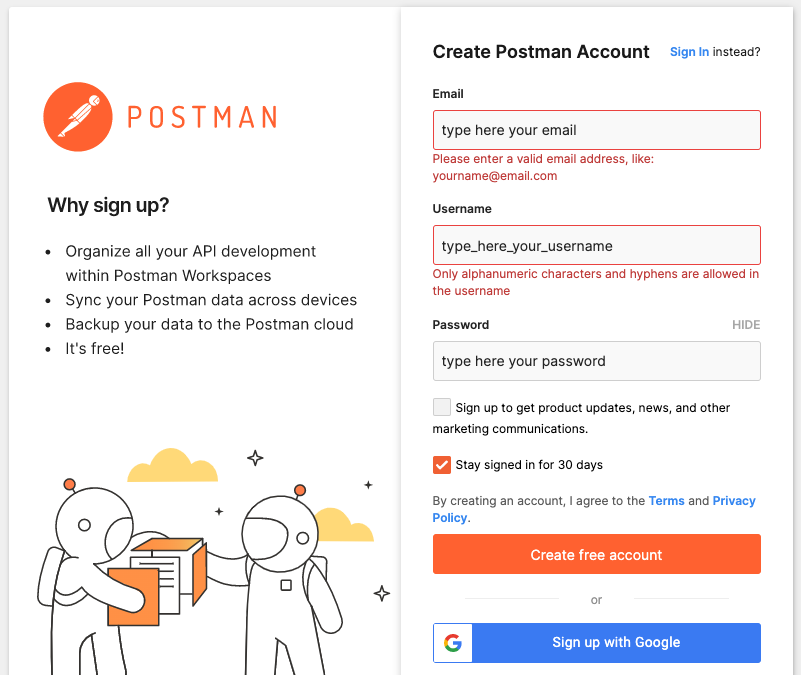

 
 

#  Postman

Postman is an API platform for building and using APIs. An account is needed to create and save simple and complex HTTP/s requests, as well as read their responses.
 

You must **create a free account** in this open-source solution following the steps below:
 

**1.** Visit [postman.com](https://www.postman.com/) and click on the **Sign Up for Free button**:

  

**2. Fill out** the requested information following the specified rules, or sign up with Google:

  
