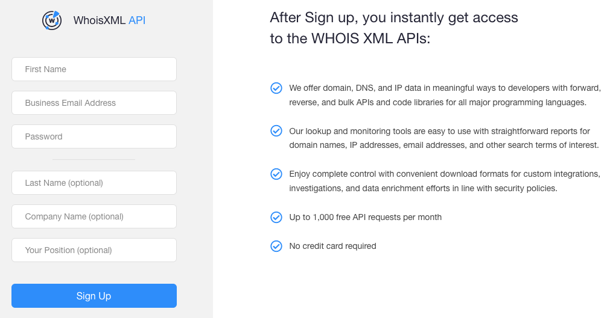

#---
#layout: categories
#icon: fas fa-stream
#order: 2
#---

 

 

WhoisXMLAPI's Hosted Whois Web Service provides registration details, also known as WHOIS Records, of a domain names, an IP addresses or an email address.
 

To consume a WhoisXMLAPI's end-point you must **create a free account** following the steps below:
 

**1.** Visit [whoisxmlapi.com](https://www.whoisxmlapi.com/) and click on the **sign up button**:

 

**2. Fill out** the requested information:

 

**3. Confirm your email** following the instructions sent to you by email.
 
